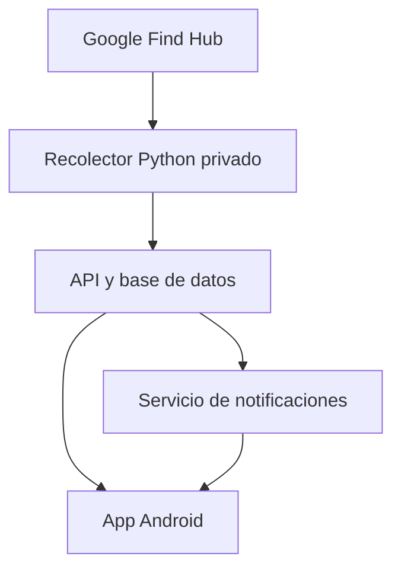

# Especificación funcional y técnica — App Android para Xiaomi Tags en Google Find Hub

**Nombre provisional:** TagMap  
**Versión del documento:** 1.0  
**Fecha:** 2 de septiembre de 2026  
**Estado:** Propuesta para MVP y evolución  

## 1. Objetivo

Desarrollar una aplicación Android privada que permita visualizar de forma más completa las posiciones disponibles de los tags Xiaomi vinculados a Google Find Hub, conservar un historial propio y emitir notificaciones opcionales cuando un tag llegue a un lugar o salga de él.

La aplicación no convierte el tag en un GPS. Cada posición proviene de la última detección realizada por la red colaborativa de dispositivos Android. Por lo tanto, la información puede ser discontinua y llegar con retraso.

## 2. Alcance del producto

### 2.1. Funciones principales

- Mostrar todos los tags disponibles en una sola pantalla.
- Mostrar la última posición de cada tag sobre un mapa.
- Indicar fecha y hora de la última detección, antigüedad, precisión y origen del reporte cuando estén disponibles.
- Guardar posiciones nuevas en una base histórica propia.
- Dibujar el recorrido aproximado por día o rango de fechas.
- Diferenciar visualmente una posición reciente, antigua o sin datos.
- Permitir crear lugares mediante un punto y un radio.
- Notificar opcionalmente cuando un tag entre o salga de un lugar.
- Permitir activar por separado las notificaciones de llegada y salida.
- Mostrar una cronología de eventos y ubicaciones.
- Permitir silenciar temporalmente alertas por tag o por lugar.

### 2.2. Fuera del alcance inicial

- Seguimiento GPS en tiempo real.
- Recuperación de posiciones históricas anteriores a la instalación del recolector.
- Publicación abierta en Google Play durante el MVP.
- Compartir credenciales de Google entre usuarios.
- Control de tags que no pertenezcan al usuario o no hayan sido compartidos con él.
- Garantizar una detección inmediata al cruzar una geocerca.

## 3. Restricciones importantes

1. Google no ofrece una API pública para consultar el historial de los tags de Find Hub.
2. La obtención de posiciones se realizará inicialmente mediante una integración no oficial basada en `GoogleFindMyTools`.
3. Google podría modificar sus servicios internos y requerir cambios en el conector.
4. El archivo de autenticación `secrets.json` contiene datos sensibles y nunca debe incluirse en el APK, repositorio, logs o respuestas de la API.
5. Las consultas deben realizarse con una frecuencia prudente. Para el MVP se recomienda cada 15 minutos, con un mínimo configurable no inferior a 5 minutos.
6. Una entrada o salida se detecta al recibir una nueva posición, no necesariamente en el instante exacto en que ocurrió.

## 4. Arquitectura recomendada

La solución tendrá tres componentes.



### 4.1. Recolector privado

Responsable de:

- Autenticarse mediante Chrome durante la configuración inicial.
- Consultar la lista de dispositivos y tags.
- Obtener y descifrar las posiciones disponibles.
- Normalizar coordenadas, precisión, fecha, fuente y estado.
- Enviar únicamente datos normalizados a la API.
- Renovar autenticación o informar errores sin exponer secretos.

Tecnología inicial:

- Python 3.12 o versión compatible con el proyecto seleccionado.
- `GoogleFindMyTools` como base técnica.
- Ejecución como servicio de Windows, contenedor o servidor privado.
- Intervalo inicial: 15 minutos.

### 4.2. API y base de datos

Responsable de:

- Registrar tags y posiciones.
- Eliminar duplicados.
- Evaluar entradas y salidas de geocercas.
- Registrar eventos y preferencias.
- Entregar mapas, historial y estados a la app.
- Enviar notificaciones push.

Opciones recomendadas:

- **MVP local:** FastAPI + SQLite.
- **Versión remota:** FastAPI o servicio equivalente + PostgreSQL/Supabase.
- **Notificaciones:** Firebase Cloud Messaging (FCM).

### 4.3. Aplicación Android

Tecnologías recomendadas:

- Kotlin.
- Jetpack Compose.
- Arquitectura MVVM o Clean Architecture liviana.
- Material 3.
- Retrofit/Ktor Client para API.
- Room para caché local.
- WorkManager para sincronización tolerante a interrupciones.
- Firebase Cloud Messaging para notificaciones.
- Google Maps SDK o MapLibre/Mapbox, según costos y preferencias.
- Hilt para inyección de dependencias.
- DataStore para preferencias.

## 5. Estrategia de mapas

### Opción A — Google Maps SDK

Ventajas:

- Experiencia conocida en Android.
- Mapas, tránsito y lugares familiares.
- Buena integración con selección de sitios.

Consideraciones:

- Requiere clave y proyecto de Google Cloud.
- Puede generar costos al superar la cuota disponible.

### Opción B — MapLibre con OpenStreetMap

Ventajas:

- Mayor control y menor dependencia de Google.
- Apropiado para recorridos, círculos y marcadores personalizados.

Consideraciones:

- Se debe seleccionar un proveedor de tiles apropiado.
- No se deben utilizar servidores públicos de OpenStreetMap como infraestructura intensiva de producción.

### Recomendación

Usar Google Maps SDK en el primer prototipo por rapidez. Diseñar una abstracción `MapProvider` para poder migrar posteriormente a MapLibre sin reescribir la lógica de negocio.

## 6. Pantallas

### 6.1. Inicio / lista de tags

Cada tarjeta mostrará:

- Nombre del tag.
- Última dirección aproximada.
- Hora de última detección.
- Antigüedad: `hace 8 min`, `hace 2 h`, etc.
- Estado visual:
  - Verde: posición reciente.
  - Amarillo: posición antigua.
  - Gris: sin información suficiente.
- Lugar reconocido, si corresponde: `Casa`, `Oficina`, `Aeropuerto`.
- Acceso rápido a mapa, historial y alertas.

Los umbrales de reciente/antigua deben ser configurables; valores iniciales sugeridos: hasta 30 minutos y más de 30 minutos.

### 6.2. Mapa general

- Un marcador por tag.
- Color o icono individual.
- Círculo de precisión.
- Agrupamiento de marcadores cercanos.
- Botón para ajustar el mapa a todos los tags.
- Filtro por tag.
- Indicador visible de la hora del último reporte.
- Leyenda que aclare que no es ubicación GPS en vivo.

### 6.3. Detalle del tag

- Nombre y fotografía/icono.
- Posición actual disponible.
- Fecha y hora exacta del reporte.
- Precisión.
- Coordenadas copiables.
- Dirección aproximada por geocodificación inversa.
- Historial de eventos.
- Selector de período.
- Acción `Actualizar` que solicita una consulta al backend respetando límites.
- Acción `Hacer sonar`, solamente si el conector y el modelo lo admiten.

### 6.4. Historial y recorrido

- Rango: hoy, ayer, 3 días, 7 días o personalizado.
- Puntos ordenados cronológicamente.
- Línea entre puntos marcada como `recorrido aproximado`.
- Filtro por precisión máxima.
- Eliminación visual de posiciones repetidas.
- Identificación de paradas estimadas.
- Lista inferior con hora, lugar y precisión.
- Exportación CSV en una fase posterior.

### 6.5. Lugares / geocercas

El usuario podrá:

- Crear un lugar manteniendo pulsado el mapa o buscando una dirección.
- Asignarle nombre, icono y color.
- Ajustar el radio mediante control deslizante.
- Elegir uno o varios tags.
- Activar `Avisar al llegar`.
- Activar `Avisar al salir`.
- Establecer días y horarios activos.
- Configurar demora mínima antes de confirmar el evento.
- Configurar período de silencio después de una alerta.

Radio inicial sugerido: 200 metros. Mínimo recomendado: 100 metros, debido a la precisión variable de la red Find Hub.

### 6.6. Centro de notificaciones

- Eventos de llegada y salida.
- Posición recuperada después de un período sin datos.
- Tag sin novedades durante un período configurable.
- Error del recolector o autenticación vencida, solo para administrador.
- Marcar como leído y filtrar por tag/lugar/tipo.

### 6.7. Configuración

- Intervalo visual de actualización.
- Unidades métricas.
- Formato de fecha y hora.
- Preferencias de notificación.
- Horarios de silencio.
- Retención del historial.
- Bloqueo de la app con biometría.
- Cierre de sesión y eliminación del dispositivo autorizado.

## 7. Reglas de geocercas

La geocerca se evaluará en el servidor cada vez que llegue una posición nueva.

### 7.1. Cálculo básico

Para cada combinación `tag + lugar`:

1. Calcular la distancia entre la posición y el centro del lugar.
2. Clasificar como `dentro` si la distancia es menor o igual al radio.
3. Clasificar como `fuera` si supera el radio más un margen de histéresis.
4. Comparar con el estado confirmado anterior.
5. Crear un evento únicamente cuando el nuevo estado sea suficientemente confiable.

### 7.2. Prevención de alertas falsas

- Histéresis inicial: 50 metros o 20 % del radio, el valor mayor.
- No cambiar de estado cuando la precisión declarada sea claramente peor que el radio.
- Confirmar el evento con dos reportes consecutivos cuando sea posible.
- Alternativamente, confirmar después de una permanencia configurable de 5 a 15 minutos.
- No reenviar el mismo evento durante el período de enfriamiento.
- Conservar en el evento la posición y precisión que provocaron la transición.

### 7.3. Estados

```text
UNKNOWN -> INSIDE
UNKNOWN -> OUTSIDE
INSIDE  -> EXIT_PENDING -> OUTSIDE
OUTSIDE -> ENTRY_PENDING -> INSIDE
```

Los cambios desde `UNKNOWN` establecen el estado inicial y no generan alerta, salvo que el usuario habilite expresamente `Notificar primera detección`.

## 8. Notificaciones

Ejemplos:

```text
Daniel llegó a Casa
Detectado dentro del área a las 18:42.
```

```text
Daniel salió de Oficina
Última detección fuera del área a las 17:16.
```

Toda notificación debe incluir la hora de la detección y evitar expresiones que impliquen tiempo real cuando el reporte sea antiguo.

Canales Android sugeridos:

- `Llegadas`.
- `Salidas`.
- `Tags sin actualizar`.
- `Estado del sistema`.

Cada canal podrá activarse, silenciarse o personalizarse desde Android.

## 9. Modelo de datos inicial

### `users`

| Campo | Tipo | Descripción |
|---|---|---|
| id | UUID | Identificador |
| email | text | Usuario de la aplicación |
| created_at | timestamp | Alta |

### `trackers`

| Campo | Tipo | Descripción |
|---|---|---|
| id | UUID | Identificador interno |
| owner_id | UUID | Propietario |
| provider_device_id | text cifrado | ID entregado por el conector |
| name | text | Nombre visible |
| icon | text | Icono seleccionado |
| color | text | Color del marcador |
| enabled | boolean | Activo |

### `locations`

| Campo | Tipo | Descripción |
|---|---|---|
| id | bigint/UUID | Identificador |
| tracker_id | UUID | Tag |
| latitude | decimal | Latitud |
| longitude | decimal | Longitud |
| accuracy_m | decimal nullable | Precisión |
| observed_at | timestamp | Hora de la detección original |
| received_at | timestamp | Hora de recepción en el sistema |
| source | text | Red, propio u otro valor normalizado |
| provider_report_id | text nullable | Control de duplicados |

Índice único sugerido: `tracker_id + observed_at + latitude + longitude`.

### `places`

| Campo | Tipo | Descripción |
|---|---|---|
| id | UUID | Identificador |
| owner_id | UUID | Propietario |
| name | text | Nombre del lugar |
| latitude | decimal | Centro |
| longitude | decimal | Centro |
| radius_m | integer | Radio |
| color | text | Color |

### `geofence_rules`

| Campo | Tipo | Descripción |
|---|---|---|
| id | UUID | Identificador |
| tracker_id | UUID | Tag |
| place_id | UUID | Lugar |
| notify_entry | boolean | Avisar llegada |
| notify_exit | boolean | Avisar salida |
| active_schedule | json | Días y horarios |
| confirmation_minutes | integer | Demora de confirmación |
| cooldown_minutes | integer | Silencio entre eventos |
| current_state | enum | UNKNOWN/INSIDE/OUTSIDE/PENDING |

### `geofence_events`

| Campo | Tipo | Descripción |
|---|---|---|
| id | UUID | Identificador |
| rule_id | UUID | Regla |
| location_id | UUID | Posición causante |
| event_type | enum | ENTRY/EXIT |
| observed_at | timestamp | Hora del reporte |
| notified_at | timestamp nullable | Hora de envío |
| status | enum | CREATED/SENT/READ/SUPPRESSED |

### `mobile_devices`

| Campo | Tipo | Descripción |
|---|---|---|
| id | UUID | Instalación Android |
| user_id | UUID | Usuario |
| fcm_token | text cifrado | Token push |
| notifications_enabled | boolean | Estado general |
| last_seen_at | timestamp | Última actividad |

## 10. API inicial

### Aplicación Android

```http
POST   /v1/auth/login
POST   /v1/auth/refresh
GET    /v1/trackers
GET    /v1/trackers/{id}
GET    /v1/trackers/{id}/locations?from=&to=&accuracy_max=
POST   /v1/trackers/{id}/refresh
POST   /v1/trackers/{id}/sound
GET    /v1/places
POST   /v1/places
PUT    /v1/places/{id}
DELETE /v1/places/{id}
GET    /v1/geofence-rules
POST   /v1/geofence-rules
PUT    /v1/geofence-rules/{id}
DELETE /v1/geofence-rules/{id}
GET    /v1/events
POST   /v1/mobile-devices/register
```

### Recolector

```http
POST /internal/v1/trackers/sync
POST /internal/v1/locations/batch
POST /internal/v1/collector/heartbeat
POST /internal/v1/collector/errors
```

Los endpoints internos utilizarán una credencial independiente, rotatoria y restringida. No compartirán el token de autenticación de Google.

## 11. Seguridad y privacidad

- Nunca almacenar contraseña de Google.
- Guardar `secrets.json` únicamente en el host del recolector, fuera del repositorio.
- Cifrar secretos en reposo y restringir permisos del archivo.
- No enviar secretos, claves E2EE ni tokens de Google al teléfono.
- HTTPS obligatorio fuera de localhost.
- Tokens de acceso breves y refresh tokens revocables.
- Android Keystore para credenciales locales.
- Biometría opcional al abrir la app.
- Deshabilitar capturas en pantallas sensibles de forma configurable.
- Ocultar coordenadas y tokens en logs.
- Registrar auditoría de inicios de sesión, creación de lugares y cambios de alertas.
- Permitir eliminar historial por tag y eliminar completamente la cuenta.
- Aplicar retención configurable, por ejemplo 30, 90, 180 o 365 días.

## 12. Sincronización y funcionamiento sin conexión

- La app conserva en Room la última posición, lugares, reglas e historial reciente.
- Al abrirse, muestra primero la caché y luego sincroniza.
- WorkManager solicita datos actualizados periódicamente, sin prometer intervalos exactos.
- Las alertas críticas se generan en el servidor y llegan por FCM, incluso si la app está cerrada.
- Si no hay conexión, la app indica claramente cuándo fue la última sincronización.
- La app no necesita pedir ubicación permanente del teléfono para mostrar los tags; solo se solicitará ubicación del usuario si se incorpora la función opcional `Crear lugar desde mi posición`.

## 13. Manejo de calidad de datos

Cada posición tendrá una clasificación:

- **Buena:** precisión menor o igual a 100 m.
- **Media:** entre 101 y 300 m.
- **Baja:** superior a 300 m o sin precisión declarada.
- **Antigua:** supera el umbral temporal configurado.

Reglas sugeridas:

- No sumar distancia recorrida cuando el salto sea incompatible con el tiempo y precisión disponibles.
- No dibujar segmentos engañosos entre puntos separados por muchas horas sin usar línea discontinua.
- Mostrar siempre la hora de observación, no solamente la hora de recepción.
- Conservar el dato original además del dato normalizado para diagnóstico, evitando secretos.

## 14. MVP propuesto

### Fase 0 — Prueba técnica obligatoria

Objetivo: validar los tags Xiaomi reales antes de construir la aplicación.

- Instalar el conector en Windows.
- Autenticar una cuenta de prueba o cuenta secundaria cuando sea viable.
- Verificar que aparecen `Daniel` y los otros tags.
- Consultar por lo menos una posición por tag.
- Confirmar los campos disponibles.
- Ejecutar consultas durante 48 a 72 horas.
- Medir frecuencia real de cambios, estabilidad y expiración de autenticación.

**Criterio de aprobación:** obtener y almacenar posiciones válidas de al menos un tag durante 48 horas sin intervención manual constante.

### Fase 1 — Backend mínimo

- Recolector programado.
- API privada.
- SQLite o PostgreSQL.
- Deduplicación.
- Historial básico.
- Logs y estado de salud.

### Fase 2 — App Android MVP

- Login privado.
- Lista de tags.
- Mapa general.
- Detalle e historial de 1, 3 y 7 días.
- Caché local.
- Estado de última actualización.

### Fase 3 — Lugares y notificaciones

- CRUD de lugares.
- Radios configurables.
- Llegada y salida por separado.
- Confirmación e histéresis.
- FCM y centro de eventos.
- Horarios de silencio.

### Fase 4 — Mejoras

- Compartir temporalmente una posición.
- Exportación CSV/Excel.
- Lugares frecuentes sugeridos.
- Estadísticas de permanencia.
- Botón para hacer sonar.
- Widget Android.
- Android Auto solamente si existe un caso válido y permitido.

## 15. Criterios de aceptación del MVP

1. La lista muestra todos los tags sincronizados.
2. Cada tag muestra posición y hora sin confundirla con tiempo real.
3. El mapa conserva y representa al menos siete días de historial.
4. La app funciona con caché cuando no hay red.
5. El usuario puede crear un lugar y ajustar su radio.
6. El usuario puede activar llegada, salida, ambas o ninguna.
7. Una alerta contiene tag, lugar y hora de detección.
8. Un cambio dudoso no produce notificaciones repetidas.
9. Las credenciales de Google no están presentes en el APK ni en la API pública.
10. La eliminación de un lugar elimina o desactiva sus reglas relacionadas de manera segura.

## 16. Pruebas necesarias

### Unitarias

- Distancia Haversine.
- Clasificación dentro/fuera.
- Histéresis.
- Estados pendientes.
- Deduplicación.
- Conversión de fecha y zona horaria.
- Clasificación de precisión y antigüedad.

### Integración

- Recolector → API.
- API → base de datos.
- Nueva posición → evaluación de reglas.
- Evento → FCM.
- App → historial paginado.
- Renovación y revocación de sesión.

### Casos de campo

- Tag permanece dentro del mismo lugar.
- Tag cruza el límite con posiciones imprecisas.
- Tag sale y no vuelve a reportar durante horas.
- Posición recibida con retraso.
- Dos reportes idénticos.
- Salto imposible entre dos ciudades.
- Autenticación del recolector vencida.
- Android con ahorro de batería y app cerrada.

## 17. Riesgos y mitigaciones

| Riesgo | Impacto | Mitigación |
|---|---|---|
| Google cambia la API interna | Alto | Aislar el conector detrás de una interfaz reemplazable |
| Expira la autenticación | Alto | Monitor de salud y alerta administrativa |
| Posiciones espaciadas | Medio | Mostrar antigüedad y evitar lenguaje de tiempo real |
| Precisión insuficiente | Alto para geocercas | Radios amplios, histéresis y confirmación |
| Bloqueo por exceso de consultas | Alto | Intervalo conservador y rate limiting |
| Robo de `secrets.json` | Crítico | Host privado, cifrado, permisos y nunca exponerlo |
| Costos del mapa | Bajo/medio | Cuotas, límites y abstracción para MapLibre |
| Restricciones Android en segundo plano | Medio | Alertas server-side mediante FCM |

## 18. Estructura sugerida del repositorio

```text
tagmap/
├── android-app/
│   ├── app/
│   ├── core/
│   ├── data/
│   ├── domain/
│   └── feature-map/
├── backend/
│   ├── api/
│   ├── geofences/
│   ├── notifications/
│   └── migrations/
├── collector/
│   ├── providers/
│   │   └── google_find_hub/
│   ├── scheduler/
│   └── health/
├── docs/
└── infrastructure/
```

La interfaz del proveedor debe permitir reemplazar `GoogleFindMyTools` sin afectar la app:

```kotlin
interface TrackerProvider {
    suspend fun listTrackers(): List<Tracker>
    suspend fun getLatestLocations(): List<TrackerLocation>
    suspend fun requestRefresh(trackerId: String): RefreshResult
    suspend fun playSound(trackerId: String): ActionResult
}
```

## 19. Decisiones recomendadas para comenzar

| Decisión | Recomendación inicial |
|---|---|
| Distribución | APK privado firmado |
| Lenguaje Android | Kotlin |
| UI | Jetpack Compose + Material 3 |
| Mapa | Google Maps SDK con abstracción |
| Backend | FastAPI |
| Base de datos | SQLite en prueba; PostgreSQL/Supabase después |
| Notificaciones | FCM |
| Recolector | Python + GoogleFindMyTools |
| Consulta | 15 minutos |
| Radio inicial | 200 metros |
| Confirmación | Dos reportes o 10 minutos |
| Historial inicial | 90 días |

## 20. Fuentes técnicas iniciales

- GoogleFindMyTools: <https://github.com/leonboe1/GoogleFindMyTools>
- Integración experimental para Home Assistant: <https://github.com/BSkando/GoogleFindMy-HA>
- Tarjeta de mapa e historial: <https://github.com/BSkando/GoogleFindMy-Card>
- Sincronizador de Find Hub con Traccar: <https://github.com/traccar/google-find-hub-sync>
- Especificación oficial de Find Hub Network: <https://developers.google.com/nearby/fast-pair/specifications/extensions/fmdn>

## 21. Próximo paso inmediato

Implementar solamente la Fase 0 en una PC Windows y generar un archivo de muestra normalizado:

```json
{
  "trackerId": "internal-id",
  "name": "Daniel",
  "latitude": -34.000000,
  "longitude": -58.000000,
  "accuracyMeters": 120,
  "observedAt": "2026-09-02T12:48:00-03:00",
  "receivedAt": "2026-09-02T12:56:00-03:00",
  "source": "find_hub_network"
}
```

Una vez confirmados los datos reales disponibles para los tags Xiaomi, congelar el contrato de la API y comenzar la aplicación Android.
